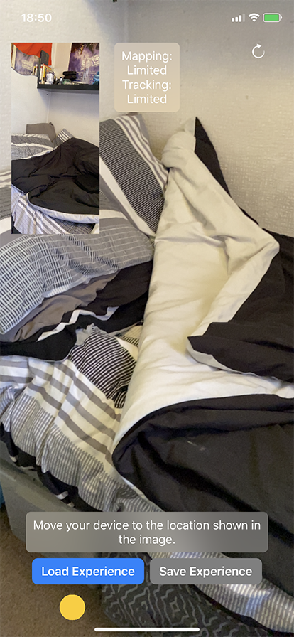

 # AR Persistence - Xamarin C#

 The objective of this was to demonstrate AR saving and loading, also known as AR persistence.
 This is a C# implementation of [Apple's saving and loading demo](https://developer.apple.com/documentation/arkit/world_tracking/saving_and_loading_world_data)

 There are a few changes though, in order to get this demo to work I had to skip frames where the frame property was returning null and camera was also null.
 ```
[Export("renderer:updateAtTime:")]
public void Update(ISCNSceneRenderer renderer, double timeInSeconds)
{
    using (var currentFrame = _sceneView?.Session?.CurrentFrame)
    {
        if (currentFrame == null || currentFrame?.Camera == null)
        {
            return;
        }
    }
}
 ```

 ### Naming Conventions

 For front end elements I use the underscore prefix. For iOS, it's easy to find yourself in a freeze because you didn't run the UI changes on the main thread, I find this easy to disinguish what are UI elements are from the VS defined variables and thus correct the issue faster. 

 ### Screenshots

 
